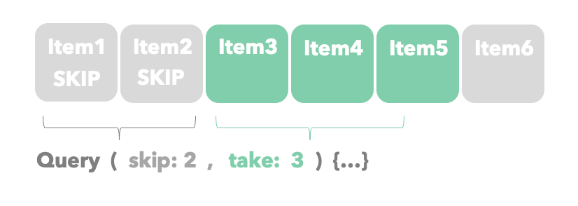
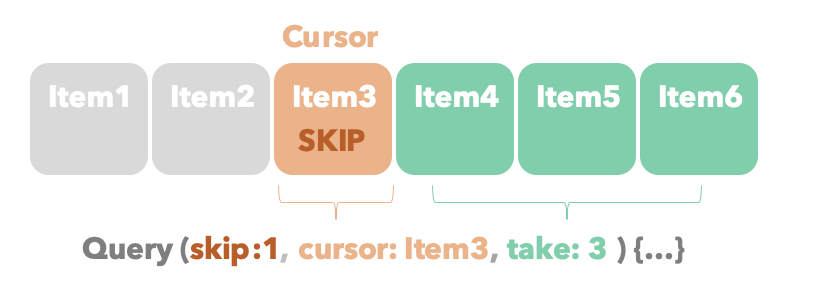

# Cursor-based pagination in Prisma and GraphQL

This **tutorial** shows how to implement **cursor-based pagination** in `GraphQL` and `Prisma`. You will use the following stack:

- [**Apollo Server**](https://github.com/apollographql/apollo-server): HTTP server for GraphQL.  
- [**GraphQL Nexus**](https://nexusjs.org/docs/): Schema generator for GraphQL.
- [**Prisma Client**](https://www.prisma.io/docs/concepts/components/prisma-client): Database ORM.                  
- [**Prisma Migrate**](https://www.prisma.io/docs/concepts/components/prisma-migrate): Database migrations.
- [**Nexus-prisma**](https://nexus.prisma.io/usage): Nexus Schema generator.    
- [**SQLite**](https://www.sqlite.org/index.html): Local, file-based SQL database.


## Contents

- [Introduction to pagination](#introduction-to-pagination)
- [Tutorial](#tutorial)
- [Prerequisites](#prerequisites)
- [Getting Started](#getting-started)
- [Bonus: Add an orderBy operator to your query](#bonus-add-an-orderby-operator-to-your-query)
- [Next steps](#next-steps)

## Introduction to pagination 

Most modern applications today use pagination of some sort to display data in subsets. These subsets are quicker to fetch, improving the user experience and lowering resource consumption.

The two most common ways of doing pagination are limit/offset and cursor-based pagination. 

1. **Limit/offset**: Uses a `limit` to determine the number of items to fetch, and `offset` to define the number of items to skip. Different frameworks and languages use the same concept. Instead of `limit` and `offset`, `Prisma` uses `take` and `skip`.



2. **Cursor-based**: Uses a `cursor` to bookmark the start of the subset. It also uses a `limit`.  The results include items from before or after the `cursor` depending on the implementation. Instead of `limit`, `offset` and `cursor`, `Prisma` uses `take`, `skip` and `cursor`.



---
**NOTE**
`GraphQL` uses the same approach. The naming convention is slightly different: `first`, `offset` and `after` instead of `take`, `skip` and `cursor`. For more information visit [GraphQL Pagination](https://graphql.org/learn/pagination/).

---

## Tutorial

## Prerequisites

This tutorial assumes you have a working copy of `GraphQL` with `Apollo`, `Nexus-Prisma` and `Prisma` Framework. Medium level knowledge in those technologies is recommended but not essential.

We have created a *Pokemon inspired* base template that works out of the box. It contains the required database, dependencies and migrations.

<details><summary><strong>Follow these steps</strong> to get the base repository up and running.</summary>

### 1. Download GraphQL base files

Download the `GraphQL` base files created for this tutorial:

```
curl -L https://github.com/george-prisma/graphql-base/archive/refs/tags/v1.0.0.tar.gz | tar -xz
```

Install npm dependencies:

```
cd graphql-base-1.0.0
npm install
```

### 2. Create and seed the database

Run the following command to create your SQLite database file. This also creates the `Pokemon` table defined in [`prisma/schema.prisma`](./prisma/schema.prisma):

```
npx prisma migrate dev --name init
```

Now, seed the database with the sample data in [`prisma/seed.ts`](./prisma/seed.ts) by running the following command:

```
npx prisma db seed --preview-feature
```

### 3. Start the `GraphQL` server

Almost there!

The following command will launch your `Apollo server`. It will also create the `schema.graphql` and `src/generated/nexus.ts` files.

Run this command:

```
npm run dev
```

Well done! Now you can navigate to `http://localhost:4000` in your browser to explore the API of your `Apollo server`.

</details>

## Getting started

Now that the base repository has a seeded `Pokemon` table, it's time to create a Nexus' `objectType` for the `GraphQL` query.

### 1. Create the `Pokemon` type

`Nexus-prisma` autogenerates the `Nexus` schema. It works in the same fashion as Prisma database schema generation. You can import it and use it from `nexus-prisma`.

Create a `types` folder to hold your Nexus' `objectTypes`. It will help you ensure the structure remains tidy moving forward.

The file should look like this:

```typescript:title=./src/types/Pokemon.ts
import { Pokemon } from 'nexus-prisma'
import { objectType } from 'nexus'

export default objectType({
  name: Pokemon.$name,
  definition(t) {
    t.field(Pokemon.id)
    t.field(Pokemon.name)
    t.field(Pokemon.hp)
    t.field(Pokemon.attack)
  },
})
```

### 2. Add the `Pokemon` type and `Context` to the `schema.ts`

Now, you will need to import the `Pokemon` type and `Context`. The `Context` is a wrapper for the `Prisma Client` used by `Apollo Server`.

You will also need to add a Nexus' `queryType` to replace the **hello** query from the base template: 

```diff typescript:title=./src/schema.ts
+ import Pokemon from './types/Pokemon'
+ import { Context } from './context'
import { makeSchema, queryType } from 'nexus'


const Query = queryType({
    definition(t) {
-       t.string('hello', { resolve: () => 'hello world' })
+       t.list.field('getAllPokemons', {
+           type: Pokemon,
+           resolve: (_parent, _args, context: Context) => {
+               return context.prisma.pokemon.findMany()
+           },
+       })
    },
})
...
```

### 3. Add arguments to the `getAllPokemons` query

Cursor-base pagination needs the following arguments to operate: 
- **Cursor**: Pokemon ID that points to the start of the page.
- **Take**: Number of Pokemons returned by the query at once.
- **Skip**: Number of Pokemons ignored from the cursor onwards.

These arguments will have the Nexus' `intArg` type.

Finally, pass the arguments to `FindMany`. **Pay special attention to default values** and remember this tutorial and `nexus-prisma` aren’t production-ready just yet. You can use the *?? notation* to set the default values.

```diff typescript:title=./src/schema.ts
import Pokemon from './types/Pokemon'
import { Context } from './context'
- import { makeSchema, queryType } from 'nexus'
+ import { intArg, makeSchema, queryType } from 'nexus'


const Query = queryType({
    definition(t) {
        t.list.field('getAllPokemons', {
            type: Pokemon,
+           args: {
+               cursor: intArg(),
+               take: intArg(),
+               skip: intArg(),
+           },
-           resolve: (_parent, _args, context: Context) => {
+           resolve: (_parent, args, context: Context) => {
                return context.prisma.pokemon.findMany(
+                   {
+                       take: args.take ?? 10,          //Returns up to 10 Pokemons in one query
+                       skip: args.skip ?? 0,           //Result doesn't skip any items
+                       cursor: {
+                           id: args.cursor ?? 1,       //Cursor points to pokemon with id = 1
+                       },
+                   }
                )
            },
        })
    },
})

...
```

## Bonus: Add an `orderBy` operator to your query

Everything looks great. Amazing work! 

By now, you should have an example with pagination working. To top off this lesson, you can also order the results by name.

`Prisma` lets you order results in **ascending** or **descending** order. In this final section, you will learn how to sort the `Pokemon` list by name.

### 1. Create the `PokemonOrderByName` type

Just like you created the `Pokemon` type, create the `PokemonOrderByName` type. The `getAllPokemons` query in `schema.ts` will use this type as an argument for ordering the list before pagination.

Create the following file:

```typescript:title=./src/types/PokemonOrderByName.ts
import { enumType, inputObjectType } from 'nexus'

const SortOrder = enumType({
    name: 'SortOrder',
    members: ['asc', 'desc'],
})

export default inputObjectType({
    name: 'PokemonOrderByName',
    definition(t) {
        t.nonNull.field('name', { type: SortOrder })
    },
})
```

### 2. Add the `orderBy` argument to the `getAllPokemons` query

The last touch is adding the `orderBy` argument to the `getAllPokemons` query in `schema.ts`.

```diff typescript:title=./src/schema.ts
import Pokemon from './types/Pokemon'
+ import PokemonOrderByName from './types/PokemonOrderByName'
import { Context } from './context'
- import { intArg, makeSchema, queryType } from 'nexus'
+ import { arg, intArg, makeSchema, queryType } from 'nexus'


const Query = queryType({
    definition(t) {
        t.list.field('getAllPokemons', {
            type: Pokemon,
            args: {
                cursor: intArg(),
                take: intArg(),
                skip: intArg(),
+               orderBy: arg({
+                   type: PokemonOrderByName,
+               }),
            },
            resolve: (_parent, args, context: Context) => {
                return context.prisma.pokemon.findMany(
                    {
                        take: args.take ?? 10,          //Returns up to 10 Pokemons in one query
                        skip: args.skip ?? 0,           //Result doesn't skip any items
                        cursor: {
                            id: args.cursor ?? 1,       //Cursor points to pokemon with id = 1
                        },
+                       orderBy: args.orderBy ?? {    //Default order is asc
+                           name: 'asc',
+                       },
                    }
                )
            },
        })
    },
})
...
```

### 3. Run a query

In the `Apollo` sandbox, run the following query:

```graphql
query Query($cursor: Int, $take: Int, $skip: Int, $orderBy: PokemonOrderByName) {
  getAllPokemons(cursor: $cursor, take: $take, skip: $skip, orderBy: $orderBy) {
    id
    name
    hp
    attack
  }
}
```

Don't forget to include the following arguments: 
```graphql
{
  "cursor": 1,
  "take": 3,
  "skip": 1,
  "orderBy": { "name": "asc" }
}
```
That's all!

Now, you should see these results:
```json
{
  "data": {
    "getAllPokemons": [
      {
        "id": 2,
        "name": "Feraligatr",
        "hp": 120,
        "attack": 10
      },
      {
        "id": 3,
        "name": "Gengar Prime",
        "hp": 130,
        "attack": 25
      },
      {
        "id": 4,
        "name": "Sneasel",
        "hp": 60,
        "attack": 25
      }
    ]
  }
}
```

## Next steps

- Check out the [Prisma docs](https://www.prisma.io/docs)
- Create issues and ask questions on [GitHub](https://github.com/prisma/prisma/)
- Watch our biweekly "What's new in Prisma" livestreams on [Youtube](https://www.youtube.com/channel/UCptAHlN1gdwD89tFM3ENb6w)
